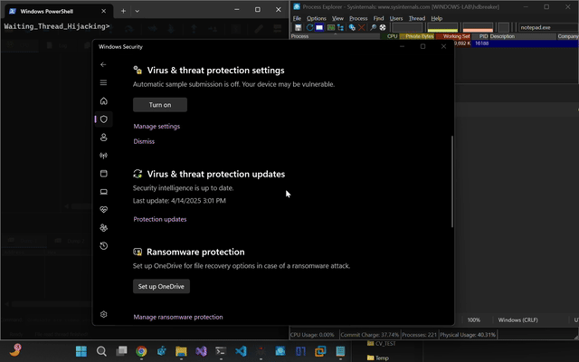

# Waiting Thread Hijacking (WTH) - Implementación en Nim

Este proyecto es una implementación en Nim de la técnica "Waiting Thread Hijacking" (WTH), una variante más sigilosa de la técnica de inyección "Thread Execution Hijacking". Esta implementación está fuertemente basada en el [código original en C](https://github.com/hasherezade/waiting_thread_hijacking) desarrollado por [@hasherezade](https://twitter.com/hasherezade).

## Acerca de la técnica

Esta técnica fue documentada por hasherezade en la investigación de Check Point Research:
[Waiting Thread Hijacking: A Stealthier Version of Thread Execution Hijacking](https://research.checkpoint.com/2025/waiting-thread-hijacking/)

WTH es una técnica de inyección que permite ejecutar código en un proceso remoto interceptando hilos en estado de espera (específicamente aquellos con estado `WrQueue`). A diferencia de la técnica clásica de Thread Hijacking, WTH evita el uso de APIs que suelen disparar alertas en los sistemas EDR, como `SuspendThread`/`ResumeThread` y `SetThreadContext`.

## Estructura del proyecto

```
NimJacker/
├── utils/
│   ├── debug.nim             # Funciones para debugging y pausas en ejecución
│   ├── memory_utils.nim      # Operaciones de memoria (dump, protección, asignación, escritura)
│   ├── ntdll_api.nim         # Definiciones de las APIs de ntdll.dll
│   ├── thread_constants.nim  # Constantes relacionadas con estados de hilos
│   └── threads_util.nim      # Utilidades para manipulación de hilos y contextos
├── shellcode/
│   └── stub_and_shellcode.nim # Definición y construcción de shellcode
├── runpe/
│   └── wht_injection.nim     # Funciones principales de inyección
├── payloads/
│   ├── calc.bin              # Payload binario (ejecuta la calculadora)
│   ├── gen_calc.py           # Script para generar el payload calc.bin
│   └── msgbox.bin            # Payload binario (muestra un mensaje)
└── nimjacker.nim               # Punto de entrada principal del programa
```

### Descripción de los componentes principales:

- **utils/debug.nim**: Proporciona funciones para depuración, incluyendo pausas controladas durante la ejecución.
- **utils/memory_utils.nim**: Contiene funciones para manipular memoria en procesos remotos.
- **utils/ntdll_api.nim**: Define las APIs de ntdll.dll necesarias para operaciones de memoria virtual.
- **utils/thread_constants.nim**: Define constantes relacionadas con estados de hilos y razones de espera.
- **utils/threads_util.nim**: Implementa utilidades para obtener información de hilos y contextos.
- **shellcode/stub_and_shellcode.nim**: Maneja la definición y construcción de shellcode.
- **runpe/wht_injection.nim**: Contiene las funciones principales para la inyección mediante WTH.
- **payloads/**: Contiene payloads binarios de ejemplo y scripts para generarlos.
- **nimjacker.nim**: Archivo principal que implementa la interfaz de línea de comandos.

## Uso

```
nimjacker <PID> [--debug]
```

### Opciones:
- `<PID>`: El ID del proceso objetivo para la inyección.
- `--debug`: Habilita el modo de depuración con pausas en puntos clave, útil para seguir la ejecución con x64dbg.

### Ejemplo de uso con modo debug:

```
nimjacker 1234 --debug
```

## Nota Importante

**Advertencia**: Esta implementación de código puede fallar ocasionalmente debido a problemas de sincronización, el estado del proceso objetivo o la configuración del sistema. La técnica WTH depende de estados específicos de los hilos que no siempre están garantizados o estables en todos los procesos objetivo.

**Nota**: Este código está diseñado para funcionar exclusivamente en sistemas con arquitectura x64. No funcionará correctamente en sistemas de 32 bits.

## Compilación

Para compilar el código:

```
nim c -f --os:windows --cpu:amd64 -d:binary nimjacker.nim
```

## Análisis con x64dbg

Se recomienda utilizar [x64dbg](https://x64dbg.com) para analizar el comportamiento de esta técnica. Al ejecutar el programa con la opción `--debug`, se realizarán pausas en puntos clave durante la ejecución, lo que permite seguir el proceso paso a paso y entender mejor cómo funciona la técnica.

## Ejemplo de funcionamiento

<p align="center">
  
</p>

## Desarrollador

Desarrollado por Alejandro Parodi ([@SecSignal](https://twitter.com/SecSignal))

## Créditos

- Concepto original y código C: [@hasherezade](https://twitter.com/hasherezade)
- Investigación: [Check Point Research](https://research.checkpoint.com)

## Licencia

Este proyecto está licenciado bajo la Licencia MIT - consulte el archivo [LICENSE](LICENSE) para más detalles. 